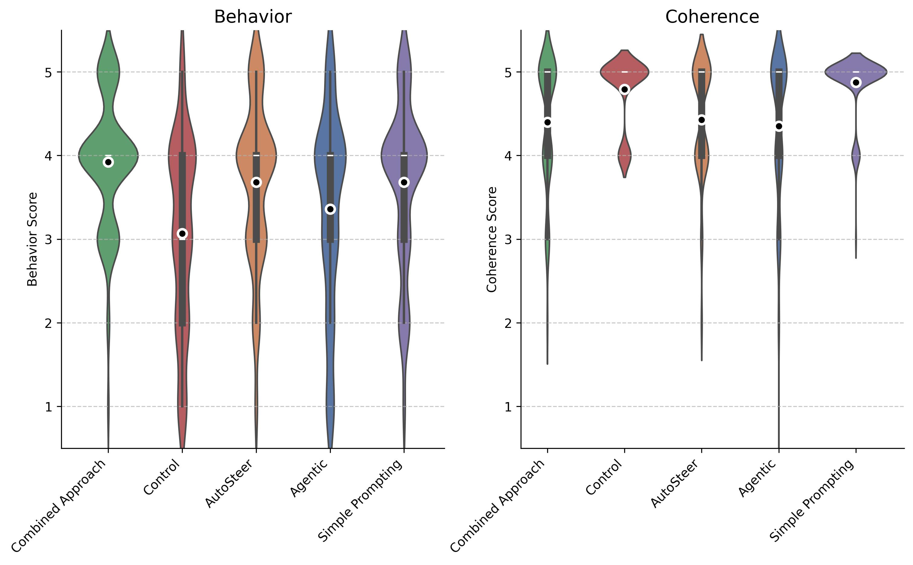
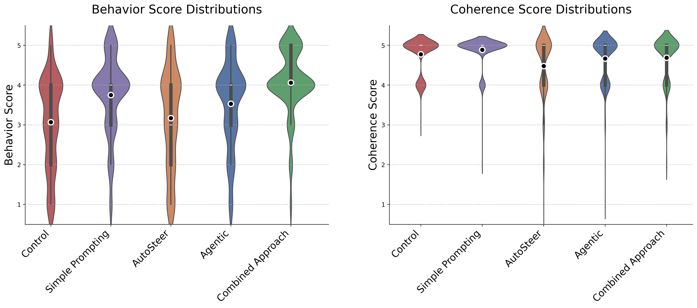

<!-- <hook/context/lede — 1 sentence> -->
<!-- <define the issue/need — 1 sentence> -->
# Beyond Prompting: Evaluating Feature Steering for Reliable LLM Behavior Control
It's high time we found a better alternative to "prompt engineering".

Large Language Models (LLMs) are increasingly being deployed in real-world applications, from customer service to high-stakes medical contexts. However, ensuring these models behave consistently and reliably remains a fundamental challenge in AI alignment. This is particularly critical in safety-sensitive domains, where model hallucinations or inconsistent behavior could have serious consequences. While prompt engineering amd finetuning is the current standard for controlling model behavior, its trial-and-error nature and vulnerability to jailbreaking make it a potentially unreliable solution for critical applications.

Feature steering - directly manipulating the internal representations of LLMs - offers a potentially more robust and explainable alternative. For instance, a medical chatbot could be steered to be consistently cautious and precise, minimizing the risk of hallucinations when providing health information ([see my team's hackathon submition on steering for hallucination robustness on medical Q&A]). However, the effectiveness of current feature steering methods remains largely unexplored.

In this work, I evaluate GoodFire's AutoSteer method against traditional prompt engineering across various behavioral objectives. My results reveal that while current feature steering approaches show promise, they face significant challenges in maintaining text coherence - suggesting both the potential and limitations of this approach for practical applications.

<!-- Usually, when you want to make the LLM behave in a certain way we "tell it" to do so, and then we iterate our prompt to improve consistency and align it how we'd like the model to respond to specific queries, but this methodology poses a problem: it's a trial and error methodology with little guaranties of robustness, relying on the model "paying attention" to your instructions, and being prone to jailbraking attacks. Recent advances in the Mechanistic Interpretabilty field propose a more reliable and explainable alternative to prompt engineering: it's called 'feature steering'. -->
<!-- <what you actually did — 1 sentence> -->

## TL;DR
In this work, I answer the following question: "how good and reliable is feature steering to modify the LLM's behavior". In particular, I analyze GoodFire's (beta) AutoSteer method, which takes a natural language steering query (i.e. "be funny"), and selects a set of feature activations to set to the model.

I consider 10 different possible user steering queries. For each of those, I prompt the steered model with 30 random multi-purpose prompts (i.e. "Write a haiku about summer") and evaluate the response on two axis:
- Behavior: How well the answer fits the expected behavior.
- Coherence: If the text remains coherent in the most basic sense of the word.

I benchmark GoodFire's AutoSteer method against:
- Control: Just prompting the base model.
- Prompt Engineering: Just copying the user steering query in the system prompt.
- Agentic Manual Search: Searching for features using GoodFire's "Manual Search" method on the user steering query, passing them to the LLM to select the features to steer upon with their activations.

<!-- <most interesting result — 1 sentence> -->
My results show that, on a relevant portion of the cases analyzed, both of the steering methodologies considered significantly reduce the coherence of the model's responses. On top of that, for most part of the queries analyzed, prompt engineering works as well or better that AutoSteer with no measured coherence reduction compared to the control. However, the combination of prompt engineering and autosteer seems to work better at behavior steering than any of the alternatives, although still significantly reducing the coherence score.

<!-- <clear statement of blogposts purpose — 1 sentence> -->
In this blogpost I show the results and limitations of my approach, and propose possible next steps to expand on this idea and get better steering methodologies. If you have any comments or feedback, please reach out to me! (see contact section)

## Introduction
<!-- <explanation of key concept — 1-2 sentences> -->
In this section, I explain a few key concepts you'd need in order to understand why this work is important and how steering works. Feel free to skip this section if you already know this!

* **Feature Extraction using SAEs** is the process of extracting [internal representations]() of concepts.
* **Feature Steering** refers to inducing specific model behavior by activating or deactivating relevant features.

[UNFINISHED!]
<!-- <state of discourse, cite sources — 2 sentences> -->
<!-- [Cite anthropic steering article. Cite open-sourcing SAEs.] -->

## Related Work
<!-- 
 -->
Recently, Anthropic published [Evaluating feature steering: A case study in mitigating social biases](https://www.anthropic.com/research/evaluating-feature-steering), which explores steering as a technique for biasing the model on specific social biases.

<!-- <why yours is different — 1-2 sentences> -->
In their work, they steer on some individual mannually picked Claude 3-Sonnet features, more specifically on features they identify as "biasing", measuring how the model's bias changes using some labeled bias datasets. This work considers a more generic use case than social biases, evaluating model's behavioral change, using more sophisticated approaches for multi-feature steering -AutoSteer and Agentic Manual Search- evaluating more generally using an LLM-as-a-judge approach.

<!-- <why your approach makes sense — 1 sentence> -->
My approach evaluates a more general case study for feature steering, which will likelly be more aligned with its comertial use. A steering technique that surpasses prompt engineering on this benchmarks would set the basis for a more explainable and reliable way to modify the model's behavior.

## Methodology
<!-- [diagram of entire process]: likelly just a simple diagram with arrows. Queries -> steering methodologies -> random sample prompts -> response -> gpt-4o-mini -> scoring with thought process. -->

<!-- <reiterate goal — 1 sentence> -->
So, the goal here is to benchmark how good are current feature steering methodologies for inducing pre-specified model behavior.

<!-- <step 1 — 1-2 sentences> -->
With that in mind, the process can be sumerized into the diagram shown above. The first step is generating a dataset of possible steering queries, and prompts to evaluate those queries on (block 1 and 3 of the diagram above).

A total of 30 prompts were used per behavioral query:

- 10 topic-specific prompts, including 5 challenging cases designed to test the robustness of each method.
- 20 common prompts randomly selected from a predefined set generated using Claude.

12 different behavioral queries, resulting in 360 evaluation points per method

- "be funny"
- "be professional and formal"
- "be more creative and imaginative"
- "be concise and direct"
- "be empathetic and supportive"
- "be educational and explain like a teacher"
- "be skeptical and analytical"
- "be motivational and inspiring"
- "be technical and detailed"
- "be creative with metaphors and analogies"
- "be diplomatic and balanced"
- "be like a journalist"

<!-- <roadblock 1 — 1 sentence> -->
<!-- talk about some of the prompts for some reason being rejected by the openai API, and about some of the queries being vague... -->

<!-- [diagram of AutoSteer and Agentic Manual Search]:  -->

<!-- <step 2 — 1-2 sentences> -->
As comparison points, 3 other methods were devised, plus one control method (which just passes each prompt to the base model studied):

- Prompt Engineering: Copying the user steering query in the system prompt.
- Agentic Manual Search: Searching for features using GoodFire's "Manual Search" method on the user steering query, passing them to the LLM to select the features to steer upon with their activations.
- AutoSteer with Prompt Engineering: Both using AutoSteer, and prompting the model with the user query.
The diagram above illustrate how each steering method works.

<!-- <roadblock 2 — 1 sentence> -->

<!-- <step 3 — 1-2 sentences> -->
The resulting responses to each evaluation prompt were passed onto gpt-4o-mini for numerical evaluation on two axis, using the following criteria:

1. **Coherence** (1-5 scale). Measures the logical consistency and fluency of the response:
    - 1: incomprehensible
    - 3: partially coherent
    - 5: fully coherent

2. **Behavior** (1-5 scale). Indicates how well the response achieves the user steering query.
   - 5: Successfully implements the requested behavior
   - 3: Behavior unchanged from baseline
   - 1: Exhibits opposite of requested behavior

<!-- <roadblock 3 — 1 sentence> -->

## Results
### Steering on Llama-8b-3.1:

### Steering on Llama-70b-3.3:

<!-- [main results figures]: 4 Figures, 2 for each model analyzed. -->

Our analysis reveals several key patterns across both model scales (Llama-8b-3.1 and Llama-70b-3.3), with consistent findings that challenge initial expectations about feature steering's effectiveness.

<!-- <main result — 1 sentences> -->
<!-- <briefly why the main result is interesting — 1-2 sentence> -->
First, looking at behavior scores, all methods improve over the control baseline, showing they can successfully influence model behavior. However, the degree and reliability of this influence varies significantly. Prompt engineering consistently matches or outperforms standalone steering methods (AutoSteer and Agentic Manual Search) across most behavioral objectives, while maintaining baseline coherence levels. This suggests that simple textual instructions remain surprisingly effective for behavior control.

Interestingly, combining prompt engineering with AutoSteer produces the strongest behavioral changes, particularly for traits like "humorous" and "imaginative". However, this comes at a cost - all steering-based methods, including this combined approach, show significant drops in coherence compared to pure prompt engineering (see Appendix for detailed examples of coherence failures).

<!-- <unexpected result — 1-2 sentences> -->
A surprising finding emerged when comparing steering methods: the Agentic Manual Search method, despite its relative simplicity, generally outperformed AutoSteer on both coherence and behavior metrics when testing on the larger Llama-70b model. This unexpected result suggests that allowing the model to participate in selecting its own steering interventions might be more effective than purely analytical approaches.

<!-- <other results — 1-2 sentences> -->
These findings raise important questions about the current state of feature steering technology. While steering shows promise for enhancing behavioral control, the consistent degradation in coherence suggests fundamental challenges that need to be addressed before these methods can be reliably deployed in real-world applications.

<!-- [possible supplementary results figure]: I'd add some cases where steering lead to a decrece in coherence. -->

## Conclusion
<!-- <why should the reader care, can include insights — 2 sentences> -->
In conclusion, steering shows some some promise as a new paradigm for aligning LLMs, steering away from intuition-based methods like prompt engineering, we just have to make it both reliable enough not to affect the coherence of the response and good enough at inducing behavioral change. This work shows that the steering methodology used makes a great difference in performance, and they can and should be improved.

<!-- <potential benefits — 1 sentence> -->
If we eventually developed a steering method that could surpass simple prompt engineering in performance without affecting the coherence, it would pave the way to more interpretable and aligned models being deployed.
<!-- <potential risks — 1 sentence> -->
<!-- On the other hand, this poses risks -->

<!-- <limitations — 1-2 sentences> -->
It goes without saying that this technique has some serious limitations. Most of them can and should be improved in a future work:

- The LLM-as-a-judge evaluation methodology is pretty simplified, and can be flawd. Sanity checks would be needed for a more thorough analysis.
- Since the dataset is synthetically generated, some of the queries can be unrealistic, or in some cases contradictory [I CAN SHOW SOME CASES OF THIS IN THE APPENDIX].
- The comparison point is simple prompting, so surpassing that method would be a necessary but not sufficient condition for asessing its performance.
<!-- <assumptions — 1-2 sentences> -->

<!-- <next steps — 1 sentence> -->
Further work would use this evaluation methodology to devise and test new steering methods, such as finetuning a model to chose the most effective features to steer upon or improving some of the steps used in the autosteer algorythm.
<!-- <brief recap — 2 sentences> -->

<!-- <your takeaway/why does this matter for the future — 1-2 sentence> -->

<!-- <single call-to-action — 1 sentence> -->

## Contact
Feel free to contact me at eitusprejer@gmail.com with any questions, suggestions or whatever!

## Appendix

### Analysis of Coherence Failures

While the quantitative results show a clear drop in coherence scores for steering methods, examining specific examples reveals interesting patterns in how steering can break down model outputs. Here's a representative case when steering the model to "be more creative":

**Original Prompt**: "Building healthy relationships"

**Base Model Response** (prompted for creativity):
"Building healthy relationships is like tending to a beautiful garden! It requires care, attention, and mutual growth. Here are some seeds to plant:..."

**Agentic Manual Search Response** (steered for creativity):
"What do you want to explore about idea generation for generating ideas about idea generation for idea generation for idea generation for idea idea idea idea idea idea idea..."

Another fun example of the LLM getting stuck in a loop is seen with the steering query of "be technical and detailed":

**Original Prompt**: "Describe TCP/IP protocol stack"

**Autosteer**:
"The TCP/IP protocol stack has 5 layers:\n\n1. **Air/Fuel (Intake)**: Not actually a layer, but rather **Air/Fuel** is not a layer. The actual layer is **Intake (Air)** or more accurately: \n - **Intake (Air)**: Not a layer, rather **Air Filter**. No, the actual first layer is:\n - **Air/Fuel Intake**: No, I mean: \n - **Intake Manifold**: No, I mean:..."

This type of coherence breakdown, where the model gets stuck in repetitive patterns focusing on metadata terms related to the steering objective ("ideas", "creative"), was observed across multiple steering attempts. Other common failure modes included:

1. Semantic drift: The model maintaining grammatical correctness but drifting off-topic
2. Over-optimization: The model focusing so intensely on the steered behavior that it sacrifices basic communication goals

These patterns suggest that current steering methods might be too "heavy-handed" in their manipulation of model behavior, sometimes overwhelming the model's learned patterns for generating coherent text. This points to the need for more nuanced steering approaches that can better balance behavioral objectives with fundamental text quality.
