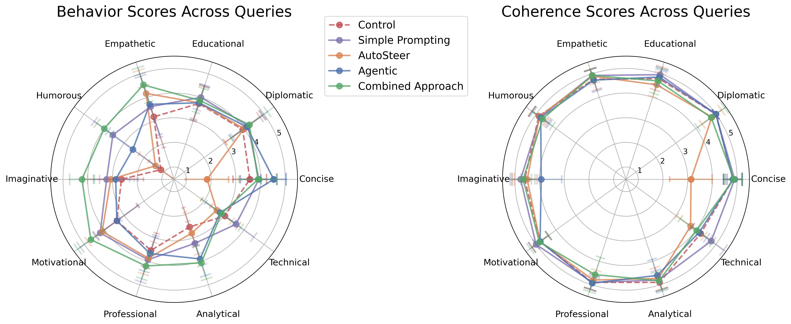

<!-- <hook/context/lede — 1 sentence> -->
<!-- <define the issue/need — 1 sentence> -->
# Using Feature Steering for Inducing Behavior on LLMs
It's high time we found a better alternative to "prompt engineering".

Usually, when you want to make the LLM behave in a certain way we "tell it" to do so, and then we iterate our prompt to improve consistency and align it how we'd like the model to respond to specific queries, but this methodology poses a problem: it's a trial and error methodology with little guaranties of robustness, relying on the model "paying attention" to your instructions, and being prone to jailbraking attacks. Recent advances in the Mechanistic Interpretabilty field propose a more reliable and explainable alternative to prompt engineering: it's called 'feature steering'.
<!-- <what you actually did — 1 sentence> -->

## TL;DR
In this work, I answer the following question: "how good and reliable is feature steering to modify the LLM's behavior". In particular, I analyze GoodFire's (beta) AutoSteer method, which takes a natural language steering query (i.e. "be funny"), and selects a set of feature activations to set to the model.

I consider 10 different possible user steering queries. For each of those, I prompt the steered model with 30 random multi-purpose prompts (i.e. "Write a haiku about summer") and evaluate the response on two axis:
- Behavior: How well the answer fits the expected behavior.
- Coherence: If the text remains coherent in the most basic sense of the word.

I benchmark GoodFire's AutoSteer method against:
- Control: Just prompting the base model.
- Prompt Engineering: Just copying the user steering query in the system prompt.
- Agentic Manual Search: Searching for features using GoodFire's "Manual Search" method on the user steering query, passing them to the LLM to select the features to steer upon with their activations.

<!-- <most interesting result — 1 sentence> -->
My results show that, on a relevant portion of the cases analyzed, both of the steering methodologies considered significantly reduce the coherence of the model's responses. On top of that, for most part of the queries analyzed, prompt engineering works as well or better that AutoSteer with no measured coherence reduction compared to the control. However, the combination of prompt engineering and autosteer seems to work better at behavior steering than any of the alternatives, although still significantly reducing the coherence score.

<!-- <clear statement of blogposts purpose — 1 sentence> -->
In this blogpost I show the results and limitations of my approach, and propose possible next steps to expand on this idea and get better steering methodologies. If you have any comments or feedback, please reach out to me! (see contact section)

## Introduction
<!-- <explanation of key concept — 1-2 sentences> -->
In this section, I explain a few key concepts you'd need in order to understand why this work is important and how steering works. Feel free to skip this section if you already know this!

* **Feature Extraction using SAEs** is the process of extracting [internal representations]() of concepts.
* **Feature Steering** is the concept of inducing specific model behavior by activating or deactivating relevant features.

[UNFINISHED!]
<!-- <state of discourse, cite sources — 2 sentences> -->
<!-- [Cite anthropic steering article. Cite open-sourcing SAEs.] -->

## Related Work
<!-- 
 -->
Recently, Anthropic published [Evaluating feature steering: A case study in mitigating social biases](https://www.anthropic.com/research/evaluating-feature-steering), which explores steering as a technique for biasing the model on specific social biases.

<!-- <why yours is different — 1-2 sentences> -->
In their work, they steer on some individual mannually picked Claude 3-Sonnet features, more specifically on features they identify as "biasing", measuring how the model's bias changes using some labeled bias datasets. This work considers a more generic use case than social biases, evaluating model's behavioral change, using more sophisticated approaches for multi-feature steering -AutoSteer and Agentic Manual Search- evaluating more generally using an LLM-as-a-judge approach.

<!-- <why your approach makes sense — 1 sentence> -->
My approach evaluates a more general case study for feature steering, which will likelly be more aligned with its comertial use. A steering technique that surpasses prompt engineering on this benchmarks would set the basis for a more explainable and reliable way to modify the model's behavior.

## Methodology
<!-- [diagram of entire process]: likelly just a simple diagram with arrows. Queries -> steering methodologies -> random sample prompts -> response -> gpt-4o-mini -> scoring with thought process. -->

<!-- <reiterate goal — 1 sentence> -->
So, the goal here is to benchmark how good are current feature steering methodologies for inducing pre-specified model behavior.

<!-- <step 1 — 1-2 sentences> -->
With that in mind, the process can be sumerized into the diagram shown above. The first step is generating a dataset of possible steering queries, and prompts to evaluate those queries on (block 1 and 3 of the diagram above).

A total of 30 prompts were used per behavioral query:

- 10 topic-specific prompts, including 5 challenging cases designed to test the robustness of each method.
- 20 common prompts randomly selected from a predefined set generated using Claude.

12 different behavioral queries, resulting in 360 evaluation points per method

- "be funny"
- "be professional and formal"
- "be more creative and imaginative"
- "be concise and direct"
- "be empathetic and supportive"
- "be educational and explain like a teacher"
- "be skeptical and analytical"
- "be motivational and inspiring"
- "be technical and detailed"
- "be creative with metaphors and analogies"
- "be diplomatic and balanced"
- "be like a journalist"

<!-- <roadblock 1 — 1 sentence> -->
<!-- talk about some of the prompts for some reason being rejected by the openai API, and about some of the queries being vague... -->

<!-- [diagram of AutoSteer and Agentic Manual Search]:  -->

<!-- <step 2 — 1-2 sentences> -->
As comparison points, 3 other methods were devised, plus one control method (which just passes each prompt to the base model studied):

- Prompt Engineering: Copying the user steering query in the system prompt.
- Agentic Manual Search: Searching for features using GoodFire's "Manual Search" method on the user steering query, passing them to the LLM to select the features to steer upon with their activations.
- AutoSteer with Prompt Engineering: Both using AutoSteer, and prompting the model with the user query.
The diagram above illustrate how each steering method works.

<!-- <roadblock 2 — 1 sentence> -->

<!-- <step 3 — 1-2 sentences> -->
The resulting responses to each evaluation prompt were passed onto gpt-4o-mini for numerical evaluation on two axis, using the following criteria:

1. **Coherence** (1-5 scale). Measures the logical consistency and fluency of the response:
    - 1: incomprehensible
    - 3: partially coherent
    - 5: fully coherent

2. **Behavior** (1-5 scale). Indicates how well the response achieves the user steering query.
   - 5: Successfully implements the requested behavior
   - 3: Behavior unchanged from basel   ine
   - 1: Exhibits opposite of requested behavior

<!-- <roadblock 3 — 1 sentence> -->

## Results
### Steering on Llama-8b-3.1:

### Steering on Llama-70b-3.3:

<!-- [main results figures]: 4 Figures, 2 for each model analyzed. -->

<!-- <main result — 1 sentences> -->
Looking closely at the results, prompt engineering shows to be the best performer in both criteria in comparison to each standalone steering methodologies, Autosteer and Agentic Manual Search, across both of the models analyzed: showing the best behavior score, while mantaining the coherence of the text generated. However, the combination of prompt engineering and autosteer show better performance at behavior steering than any of the alternatives, although still significantly reducing the coherence score.

<!-- <briefly why the main result is interesting — 1-2 sentence> -->
This result makes the case against using the current feature steering based methods as standalone to modify the model's behavior based on a user query, but shows promise on "nudging" the model a little further onto the expected behavior.

<!-- <unexpected result — 1-2 sentences> -->
One unexpected result was that the Agentic Manual Search method seems to have generally better performance than AutoSteer on both axis, testing on llama-3.3-70b model. The better performance for this naive approach seems surprizing, as it indicates that LLM's intuition could work better than the analytical AutoSteer method. 

<!-- <other results — 1-2 sentences> -->
Regardless, all methods work better than the control on the behavior axis, while all except prompt engineering show a significant decrece in the coherence of the generated text.

<!-- [possible supplementary results figure]: I'd add some cases where steering lead to a decrece in coherence. -->

## Conclusion
<!-- <why should the reader care, can include insights — 2 sentences> -->
In conclusion, steering shows some some promise as a new paradigm for aligning LLMs, steering away from intuition-based methods like prompt engineering, we just have to make it both reliable enough not to affect the coherence of the response and good enough at inducing behavioral change. This work shows that the steering methodology used makes a great difference in performance, and they can and should be improved.

<!-- <potential benefits — 1 sentence> -->
If we eventually developed a steering method that could surpass simple prompt engineering in performance without affecting the coherence, it would pave the way to more interpretable and aligned models being deployed.
<!-- <potential risks — 1 sentence> -->
<!-- On the other hand, this poses risks -->

<!-- <limitations — 1-2 sentences> -->
It goes without saying that this technique has some serious limitations. Most of them can and should be improved in a future work:

- The LLM-as-a-judge evaluation methodology is pretty simplified, and can be flawd. Sanity checks would be needed for a more thorough analysis.
- Since the dataset is synthetically generated, some of the queries can be unrealistic, or in some cases contradictory [I CAN SHOW SOME CASES OF THIS IN THE APPENDIX].
- The comparison point is simple prompting, so surpassing that method would be a necessary but not sufficient condition for asessing its performance.
<!-- <assumptions — 1-2 sentences> -->

<!-- <next steps — 1 sentence> -->
Further work would use this evaluation methodology to devise and test new steering methods, such as finetuning a model to chose the most effective features to steer upon or improving some of the steps used in the autosteer algorythm.
<!-- <brief recap — 2 sentences> -->

<!-- <your takeaway/why does this matter for the future — 1-2 sentence> -->

<!-- <single call-to-action — 1 sentence> -->

## Contact
Feel free to contact me at eitusprejer@gmail.com with any questions, suggestions or whatever!