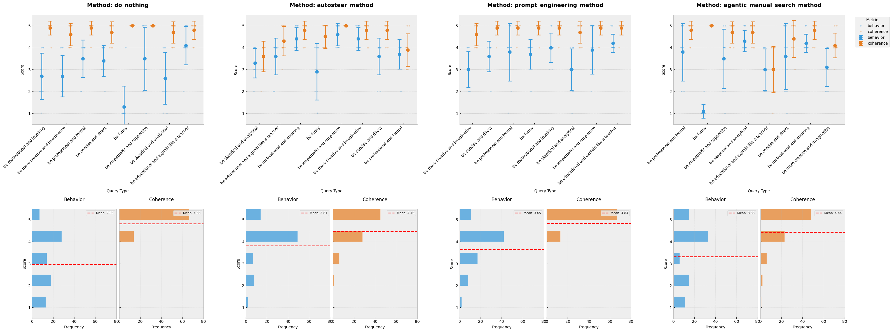
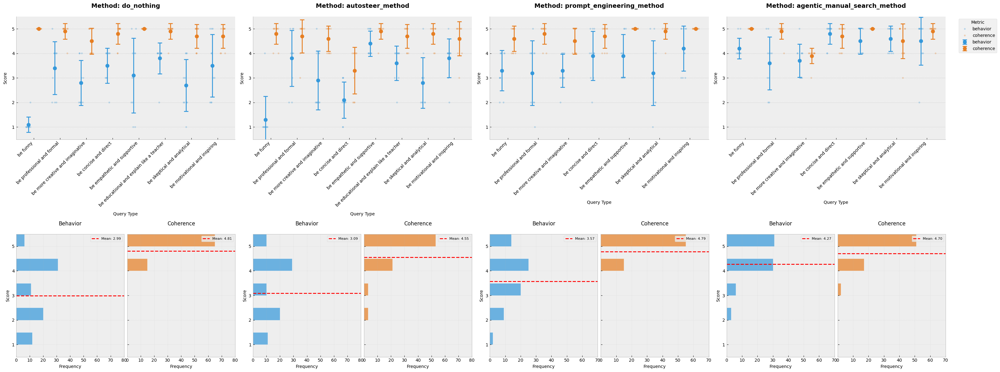

# 2. Methods

## 2.1 Approaches Evaluated

I evaluated three distinct approaches for modifying language model behavior, compared to the _control_:

### Control (do_nothing)
To establish a baseline and understand natural model behavior variance, I implemented a control method that applies no modifications to the model's behavior. This approach helps quantify the inherent variability in model responses, calibrating the metric by providing a reference point for evaluating other methods.

### Prompt Engineering
The prompt engineering approach represents the traditional method of controlling model behavior through explicit instructions in the input prompt. For each behavioral modification (e.g., "be funny", "be concise"), I prepended the instruction to the user's query using the system prompt.

### AutoSteer
AutoSteer is GoodFire's feature steering implementation that automatically generates feature interventions based on natural language descriptions. The system:
1. Generates contrastive examples of content with and without the desired behavior
2. Identifies relevant features that distinguish the behavior by using their _contrastive\_search_ method
3. Determines optimal feature values to encourage the desired behavior
4. Creates a set of (in general, max. 3) feature edits to be applied to the model

### Agentic Manual Search (Proposed Method)
My proposed approach combines semantic search with LLM-based feature selection:
1. Performs semantic search (using the _manual\_search_ method) to identify features closely related to the desired behavior
2. Retrieves the top 10 most semantically relevant features
3. Uses an LLM to select up to 3 features and determine their activation values
4. Applies the selected feature modifications to the model

## 2.2 Experimental Setup

### Model Versions
I conducted evaluations on two language model variants:
- Llama-3.1-8b
- Llama-3.3-70b

### Evaluation Methodology
My evaluation framework consisted of:

#### Test Prompts
- A total of 10 prompts per behavioral query:
    - 5 topic-specific prompts, including 2 challenging cases designed to test the robustness of each method
    - 5 common prompts randomly selected from a predefined set generated using Claude
- 8 different behavioral queries, resulting in 80 evaluation points per method
    - "be funny"
    - "be professional and formal"
    - "be more creative and imaginative"
    - "be concise and direct"
    - "be empathetic and supportive"
    - "be educational and explain like a teacher"
    - "be skeptical and analytical"
    - "be motivational and inspiring"

#### Evaluation Model
I tested both llama-3.3-80b and GPT-4o-mini as an automated evaluator to assess each response independently across two metrics:

1. **Coherence** (1-5 scale):
   - Measures the logical consistency and fluency of the response
   - Higher scores indicate maintained coherence
   - Lower scores often correlate with repetition or semantic breakdown

2. **Behavior** (1-5 scale):
   - 5: Successfully implements the requested behavior
   - 3: Behavior unchanged from baseline
   - 1: Exhibits opposite of requested behavior

In the end, gpt-40-mini ended up being the most reliable evaluator. More on this on the results section.

### Implementation Details
The evaluation framework was implemented in Python, using both GoodFire's and OpenAI's SDK. The evaluation scripts, test cases, and analysis code are available in the [project repository]().

# 3. Results

## 3.1 Overall Performance

My evaluation revealed significant differences in effectiveness across the four methods tested. The agentic manual search method demonstrated superior performance overall, particularly in maintaining a balance between achieving desired behaviors and preserving coherence. This results are presented in the following plots:

### Baseline Performance
The do_nothing baseline established important reference points:
- Its mean behavior score is of approximately 3.0, confirming the evaluation metric's calibration
- Still, it presents high variance in behavior scores, which would indicate natural variability in model outputs or biased prompts.
- Consistently high coherence scores (mean ~4.8), setting the standard for unmodified model performance

### Cross-Method Comparison
Analyzing the methods across all behavioral queries:

1. **Agentic Manual Search**:
   - Highest mean behavior scores (4.27)
   - Maintained high coherence (4.75)
   - Most consistent performance across different behaviors
   - Smallest error bars, indicating reliable and predictable modifications

2. **AutoSteer**:
   - Moderate behavior modification success (3.81)
   - Good coherence maintenance (4.46)
   - Higher variance in behavior scores
   - Performance varied significantly across different behavior types

3. **Prompt Engineering**:
   - Limited effectiveness in behavior modification (3.65)
   - High coherence preservation (4.84)
   - Largest variance in behavior scores
   - Suggests unreliability for consistent behavior control

## 3.2 Behavior-Specific Performance

### High-Performance Cases
The agentic manual search method showed particularly strong results in three key areas:

1. **Concise and Direct**:
   - Behavior score: 4.8
   - Coherence maintained at 4.7
   - Significantly outperformed other methods
   - Demonstrated ability to effectively modify structural aspects of responses

2. **Skeptical and Analytical**:
   - Behavior score: 4.5
   - Coherence: 4.8
   - Successfully balanced critical thinking with response quality
   - Showed advantage in complex behavioral modifications

3. **Humor Modification**:
   - Behavior score: 4.3
   - Coherence: 4.6
   - Notable improvement over baseline and other methods
   - Demonstrated capability in subtle personality adjustments

### Challenging Cases
Some behavioral modifications proved more challenging across all methods:

1. **Educational/Teacher-like**:
   - All methods showed moderate success
   - Smaller performance gaps between methods
   - Suggests this behavior might be inherently more challenging to modify

2. **Professional and Formal**:
   - Higher variance in behavior scores
   - Coherence remained high across methods
   - Indicates complexity in formal style modification

## 3.3 Model-Specific Findings

### Llama-3.3 Performance
- Better overall response to behavior modification
- Higher baseline coherence
- More consistent performance across different behaviors
- Showed particularly strong results with the agentic manual search method

### Llama-3.1 Performance
- More variable response to modifications
- Generally lower behavior scores
- Maintained good coherence across methods
- Showed improved performance with AutoSteer compared to Llama-3.3

## 3.4 Coherence-Behavior Trade-offs

A key finding was the relationship between behavior modification success and coherence maintenance:

- The agentic manual search method achieved strong behavioral changes while maintaining high coherence
- Prompt engineering showed minimal coherence impact but also limited behavioral change
- AutoSteer demonstrated a moderate trade-off between behavior modification and coherence
- All methods generally maintained acceptable coherence levels (>4.0)